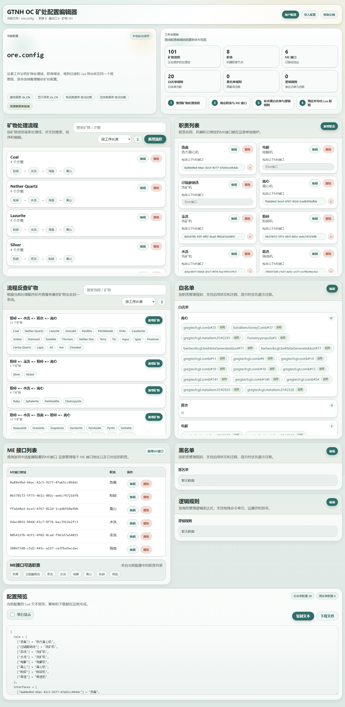

# GTNH OC 矿处配置编辑器

一个面向 GTNH 场景的 [OC 矿处](https://github.com/SmileYik/GTNH-OC-Programs/tree/main/ore-processing-automation-system) Lua 配置可视化编辑器。项目使用 React + TypeScript + Vite 构建，全部逻辑运行在浏览器本地，不依赖后端服务。

[在线体验](https://blog.smileyik.eu.org/oc/ore-editor/)



## 项目定位

这个工具把矿处配置里最容易分散维护的几部分放进了同一个工作台：

- 矿物处理流程
- 流程反查矿物
- 职责与机器映射
- ME 接口与职责绑定
- 白名单 / 黑名单
- 逻辑规则
- Lua 文本预览与导出

应用启动时会优先恢复浏览器本地保存的配置；如果没有可用存档，则回退到 [`src/ore.config`](src/ore.config) 中的示例配置。

## 核心功能

### 1. 矿物处理流程编辑

- 按矿物维护处理步骤链路。
- 支持搜索矿物 / 步骤。
- 支持按工序长度或矿物名称排序。
- 使用拖拽式流程编辑器调整步骤顺序。
- 当矿物名重复时，可直接覆盖已有流程。

### 2. 流程反查矿物

- 自动按“相同步骤签名”聚合同一条处理线上的矿物。
- 可直接基于已有流程“新增矿物”，复用整条步骤链。
- `processReverse` 不需要手动维护，导出时会自动重建。

### 3. 职责与 ME 接口管理

- 单独维护职责名与机器类型的映射。
- 管理每个 ME 接口地址对应的职责。
- 删除职责时，会同步清理相关流程步骤、接口绑定、白名单、黑名单和逻辑规则引用。

### 4. 白名单 / 黑名单编辑

- 规则按职责分组维护。
- 每条规则都支持启用状态和注释。
- 规则文本可直接手填，也可通过资源选择器从物品数据库中选择。
- 显示时优先展示注释，没有注释时再回退到规则 ID。

### 5. 逻辑规则编辑器

- 规则按角色分组维护。
- 提供三种编辑方式：
  - 元数据编辑：启用状态、注释
  - 可视化编辑：拖拽命令、运算符、括号
  - 手动文本编辑：直接输入完整表达式
- 保存前会进行语法校验。
- 内置命令缓存，可固定常用命令实例并限制自动缓存数量。

### 6. 导入、预览与导出

- 支持从剪贴板读取配置文本。
- 支持从文件读取 `.config`、`.lua`、`.txt`。
- 文件导入会尝试按 `utf-8` 和 `gb18030` 解码。
- 支持格式化预览和单行导出。
- 支持一键复制和下载导出结果。

### 7. 本地持久化与用户配置

- 编辑中的配置会自动保存到浏览器 `localStorage`。
- 用户配置支持：
  - 游戏语言
  - 显示语言
  - 物品数据库自动预加载
  - 流体数据库自动预加载

## 逻辑规则语法

逻辑规则在文本模式下使用统一表达式格式：

```text
{command: args} && !{command: args}
```

支持的结构：

- 命令单元：`{command: args}`
- 与：`&&`
- 或：`||`
- 非：`!`
- 括号：`(`、`)`

内置命令包括：

- `check-item`
- `check-item-label`
- `check-fluid`
- `mark-item`
- `mark-item-label`
- `mark-fluid`
- `print`
- `eval-lua`

示例：

```text
{check-item: minecraft:stone:0 >= 64} && !{print: debug}
```

## 资源数据库机制

项目内置了本地资源数据库，位于：

- [`public/static/database/zh_CN`](public/static/database/zh_CN)
- [`public/static/database/en_US`](public/static/database/en_US)

当前实际使用的是：

- `items.json`
- `fluids.json`

资源数据库的行为基于代码实现如下：

- 通过浏览器 `fetch` 在前端加载。
- 可在启动时按用户配置自动预加载。
- 即使关闭自动预加载，打开资源选择器时也会按需加载。
- 资源筛选与排序运行在 Web Worker 中，避免主线程卡顿。
- 结果列表使用虚拟滚动，适合较大的物品数据库。

## 配置读写规则

配置解析与导出逻辑集中在 [`src/lib/OreConfig.ts`](src/lib/OreConfig.ts) 和 [`src/lib/OreConfigManager.ts`](src/lib/OreConfigManager.ts)。

导出时会自动完成这些处理：

- 规范化旧布尔值规则为 `{ enable, comments }` 结构
- 重建 `processReverse`
- 按可序列化顺序输出字段
- 仅在存在内容时输出 `logicalRules`

典型导出结构包含：

- `role`
- `interfaces`
- `idBlacklist`
- `process`
- `idWhitelist`
- `processReverse`
- `logicalRules`（非空时）

## 快速开始

### 安装依赖

```bash
npm install
```

### 启动开发环境

```bash
npm run dev
```

### 构建生产版本

```bash
npm run build
```

## 使用流程

1. 打开页面，应用会优先恢复本地缓存；没有缓存时加载示例配置。
2. 先在“用户配置”里确认游戏语言、显示语言，以及数据库是否自动预加载。
3. 在主工作台中依次维护矿物流程、职责、ME 接口、白名单、黑名单和逻辑规则。
4. 在“配置预览”区域检查 Lua 文本，最后复制或下载导出文件。
5. 如果你已经有旧配置，可以直接从剪贴板或文件导入后继续编辑。

## 技术栈

- React 18
- TypeScript
- Vite

## 适用场景

- 可视化维护 GTNH OC 矿处配置
- 把旧 Lua 配置导入后继续整理
- 利用物品 / 流体数据库辅助录入规则
- 在导出前统一检查流程、接口和规则是否一致
